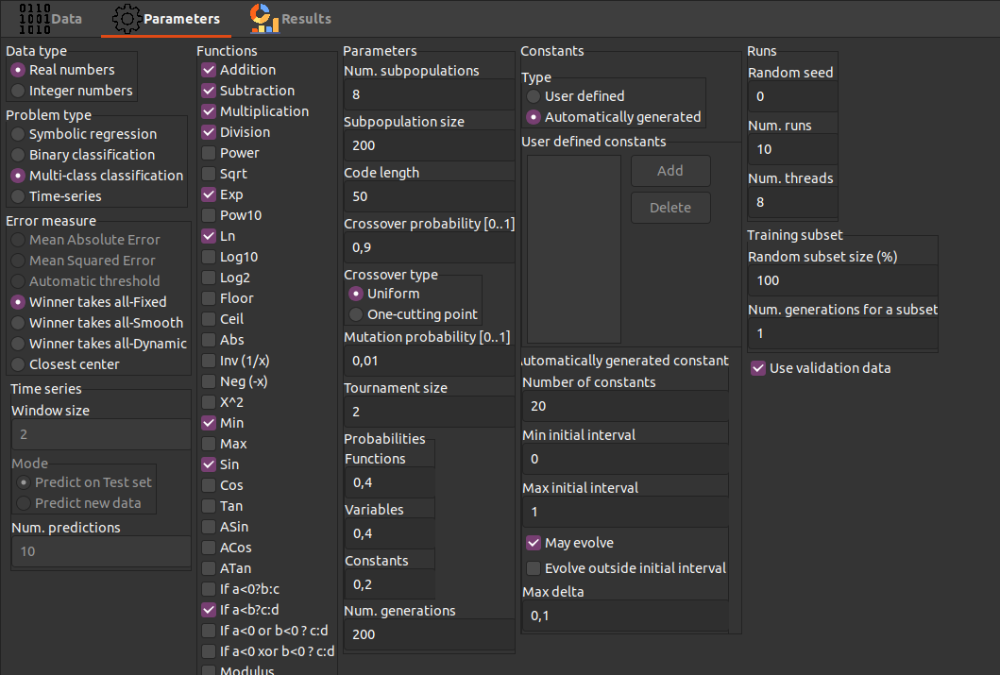
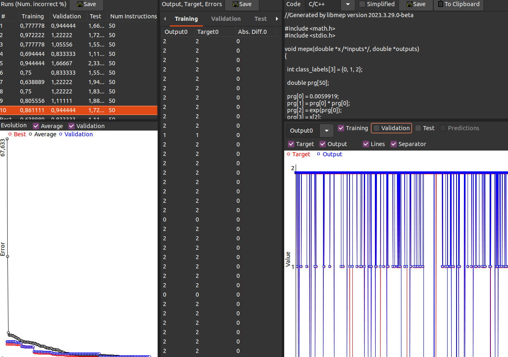

# IA_minibots_T4_Programaci-n_Genetica
## 4.12. Ejercicios
**De los ejercicios 1 y 2, escoja 1 para realizar; y hacer 3 o 4.**

### 1. Descargue MEPX, https://www.mepx.org/, estúdielo y corra uno de los ejemplos que trae.

**MEPX** (Multi Expression Programming X) es una herramienta de computación evolutiva diseñada para resolver problemas complejos de análisis de datos sin intervención humana.

En términos sencillos: es un programa que combina una cantidad de funciones matemáticas y terminales para crear fórmulas matemáticas que explican los datos.

Su funcionamiento se basa en la creación de una población de fórmulas matemáticas que se evalúan según su capacidad para explicar los datos. Las fórmulas que mejor explican los datos son seleccionadas y combinadas para crear nuevas fórmulas que se evalúan nuevamente. Este proceso se repite hasta que se encuentra una fórmula que explica los datos de manera satisfactoria.

MEPX necesita de la carga de dos archivos, uno de entrenamiento y otro de prueba, ambos son archivos de tipo csv (Comma Separated Values), el cual es un archivo de texto que contiene **datos separados por un caracter especial**, el cual puede ser una coma, un punto y coma, o un tabulador, y en donde la primera fila indica el nombre de las columnas. Las columnas se dividen en las **variables independientes (Entradas)** que corresponde a las columnas de la primera a la penultima y la **variable dependiente (Salida)** en la ultima columna.

La separación de datos es fundamental para evitar el overfitting, el cual es el fenómeno por el cual el modelo se ajusta demasiado a los datos de entrenamiento y no generaliza bien a nuevos datos. En el caso de MEPX, el archivo de entrenamiento se utiliza para entrenar el modelo y el archivo de prueba se utiliza para evaluar el modelo.

---

Luego de importar los datos, en la pestaña de parametros, definimos las  reglas de la programación genética. Se define el tamaño de la población, el número de generaciones y funciones que se pueden usar para la explicación del comportamiento de los datos. 

  

---

En la ultima pestaña, se muestra el resultado del proceso de programación genética. La cual se compone de un grafico de evolución de la población, un panel de la mejor solución y un panel de la solución promedio. Tambien contiene una comparativa de los datos de entrenamiento y prueba con la solución encontrada. y una ventana de codigo con la mejor formula encontrada en el formato de lenguaje de programacion que se desee.

  

---
Con estos parametros, MEPX inicia el proceso de programación genética. Las fórmulas que mejor explican los datos son seleccionadas y combinadas para crear nuevas fórmulas que se evalúan nuevamente. Este proceso se repite hasta que se encuentra una fórmula que explica los datos de manera satisfactoria. 

Este programa generado, se puede exportar a lenguajes de programacion como C, C++ o Python, lo cual representa una herramienta de gran utilidad para la prediccion de comportamientos complejos.

Entre las respuestas que puede ofrecer MEPX se encuentran: 

 - Regresión de valores continuos
 - Clasificación binaria.
 - Clasificación categorica (Multiples grupos discretos).
 - Regresión de series temporales.
 - Aproximación de funciones logicas.

 El ejemplo explorado usa una colección de 20 datos con 1 salida de 3 estados (0,1,2), la cual trabaja con numeros reales y funciones de (+,-,*,/,exp, ln, min, sin, y <), con el fin de predecir los problemas de tiroides de un paciente.

### 2. Suponga que desea utilizar Programación Genética para encontrar el diseño de un circuito lógico, tome como, ejemplo el codificador de 7 segmentos. Describa el conjunto de terminales, el conjunto de funciones y la función de aptitud. Use una librería de Python.
### 3. Suponga que tiene un robot que le entrega galletas al grupo de ingenieros de diseño de robots. Programe por PG el recorrido del robot, teniendo en cuenta que cada vez que un ingeniero recibe una galleta gana puntos. Los ingenieros están distribuidos en una sala cuadrada. Defina, conjunto de terminales, conjunto de funciones y función de aptitud.
### 4. Vea el video, https://www.youtube.com/watch?v=6KNuJn6dVy4. Analícelo y haga un ejemplo de control aplicando PG.

En el control mediante Programación Genética, la ley de control no se diseña manualmente. El algoritmo genera varias expresiones matemáticas candidatas, las evalúa mediante una función de desempeño y mediante selección, cruce y mutación, evoluciona hacia una ley de control óptima. Entonces haremos el siguiente ejemplo:

PROBLEMA: Queremos controlar la temperatura de una habitacion

-Tempereatura deseada:25°C
-Temperatura actual:20°C

Entonces 

Error=referencia - salida= 25 - 20= 5 (El controlador debe decidir que potencia darle al calefactor)

Lo que hace la programacion genetica es crear muchas formulas al azar para luego probar cual de esas funciona mejor, luego de eso mejora las mejores formulas y asi se repite hasta que lograr encontrar une buena ley de control. Entonces:

PASO 1: General controladores aleatorios

-u=error

-u=2 x error

-u= error x error 

-u = error - 1

Cada una manda una diferente potencia al calefactor 

PASO 2: Probar cada formula 

Caso 1: u=error (La temperatura sube lento)

Caso 2: u=2 x error (La temperatura llega mas rapido a 25)

Caso 3: u=error x error (La temperatura sube demasiado y se pasa)

PASO 3: Medir cual es mejor, para esto se usa una medida de desempeño en la cual si el error total en el tiempo es menor, entonces es mejor el controlador 

PASO 4: La programacion genetica toma las mejores y las combina para crear una nueva y es algo que se repite muchas veces.

Ahora miremo como se aplica en phyton con mas variables como la perdida de calor o la eficiencia del calefactor. el codigo nos muestar como resultado lo siguiente:

En este código simulé el control de temperatura de una habitación usando un modelo sencillo donde existe pérdida de calor hacia el ambiente y un controlador proporcional de la forma u=K⋅error. Al ejecutar la simulación en el tiempo, se observa que la temperatura aumenta rápidamente al inicio porque el error es grande y, por lo tanto, la acción de control también lo es. Después, el sistema se estabiliza de manera suave cerca de la referencia de 25 °C, sin presentar comportamientos inestables. Pero, la temperatura no llega exactamente al valor deseado, sino que se queda un poco por debajo, lo cual demuestra la presencia de error en estado estacionario, algo característico de un controlador proporcional. En general, los resultados obtenidos son coherentes con la teoría y muestran que el modelo funciona correctamente.
